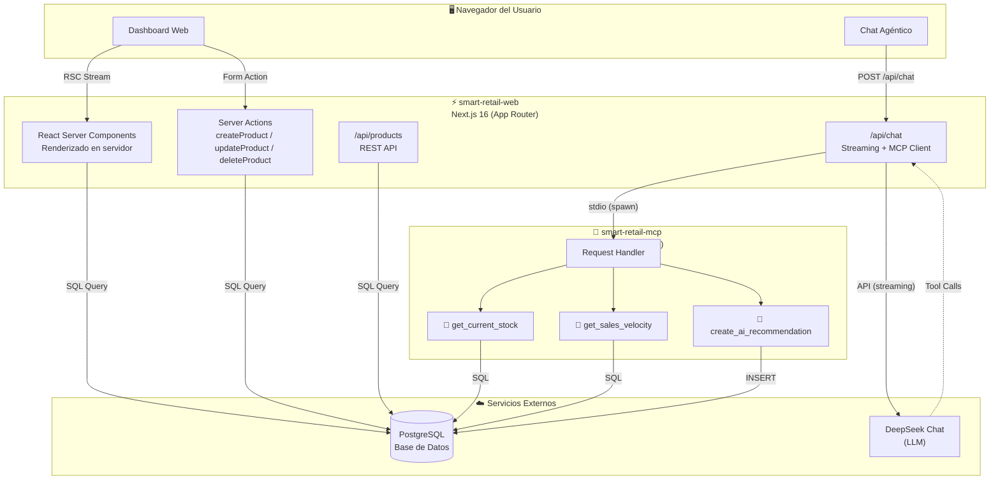
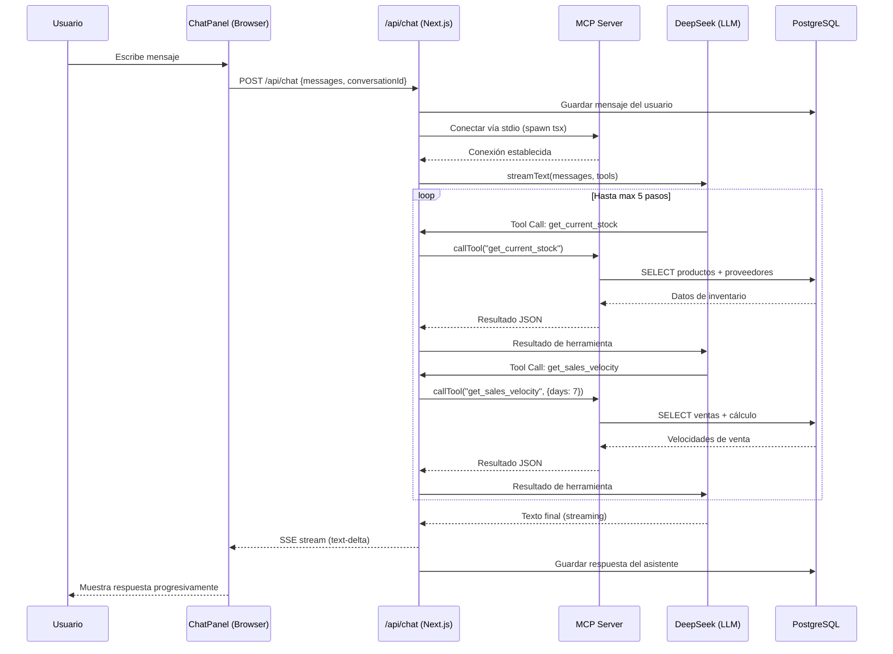
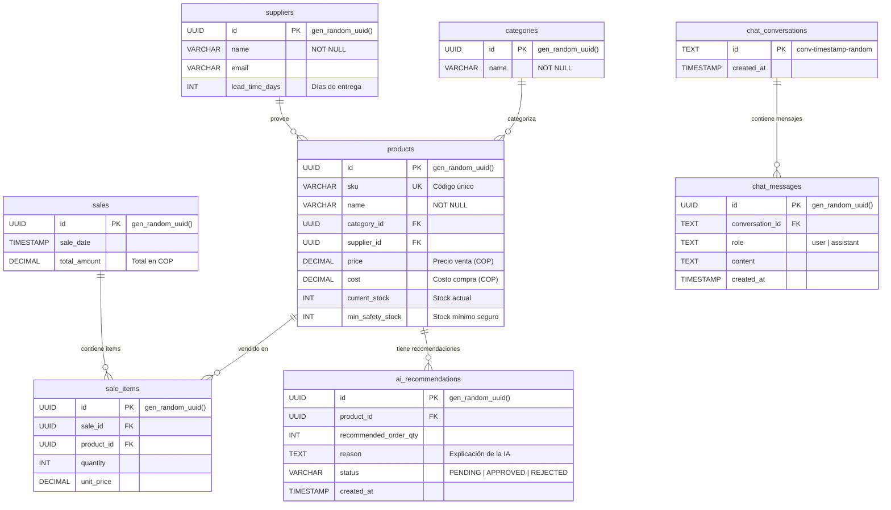
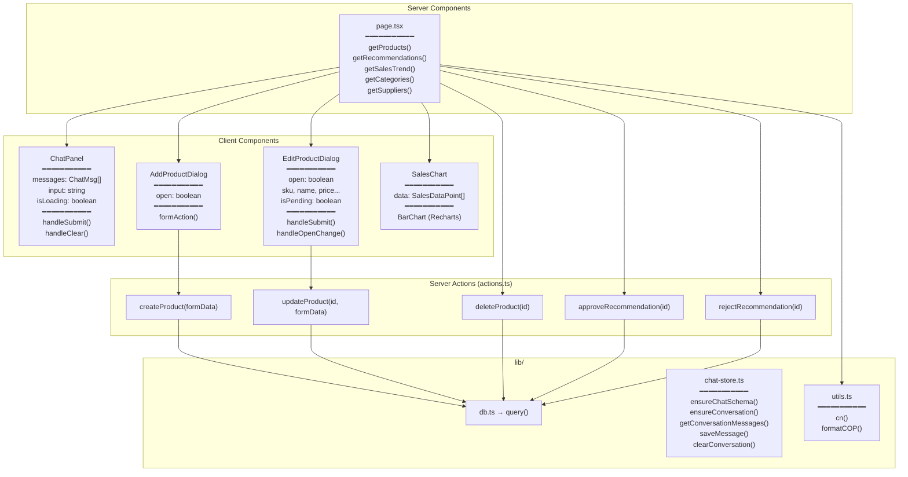
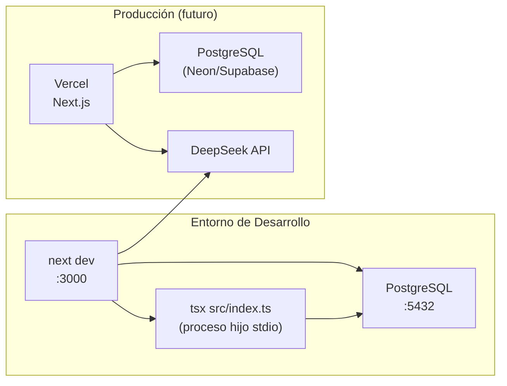

# 📐 Diagramas de Arquitectura — Smart Retail

Todos los diagramas usan sintaxis [Mermaid](https://mermaid.js.org/) y se renderizan automáticamente en GitHub.

---

## 1. Diagrama de Arquitectura General

---

## 2. Diagrama de Secuencia — Chat Agéntico

---

## 3. Diagrama Entidad-Relación (Base de Datos)

---

## 4. Diagrama de Componentes Frontend

---

## 5. Diagrama de Deployment

---

## Notas

- Los diagramas Mermaid se renderizan automáticamente en GitHub, GitLab y la mayoría de editores Markdown.
- Para exportar como imagen: usar [mermaid.live](https://mermaid.live/) o la extensión de VS Code "Markdown Preview Mermaid Support".
